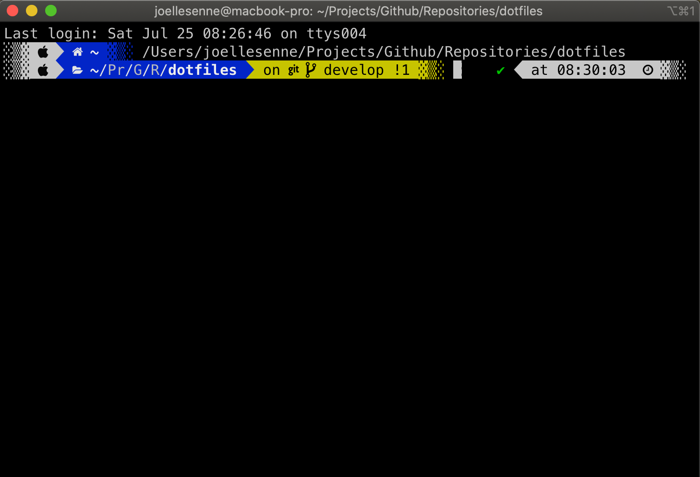
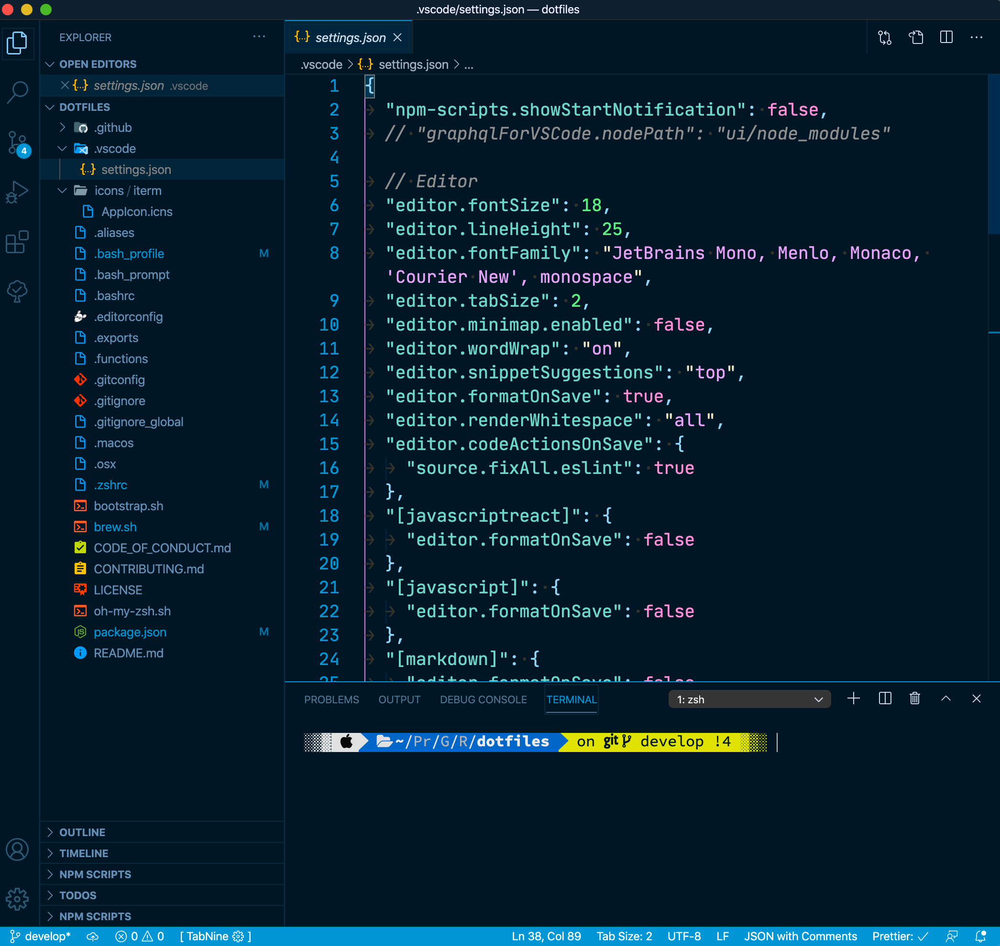

## Hello,

> Je viens de remplacer mon vieux MacBook (2015) et pourquoi ne pas partager ma configuration de développement nouvellement installé !

La configuration de votre outil de travail et bien souvent stoker dans des fichiers [dot](https://en.wikipedia.org/wiki/Hidden_file_and_hidden_directory) (fichiers dont le nom commence par un point et ce trouve caché sur votre hôte). Vous retrouverez sur Github mon [dotfiles](https://github.com/joellesenne/dotfiles), vous pouvez me laisser une [issue](https://github.com/joellesenne/dotfiles/issues) ou j'essayerais d'y répondre. J'ai trouvé l'inspiration avec [Simon Owen](https://css-tricks.com/using-dotfiles-for-managing-development-and-many-other-magical-things/), [Mathias Bynens](https://github.com/mathiasbynens/dotfiles) et une très jolie configuration chez [Tania Rascia](https://www.taniarascia.com/setting-up-a-brand-new-mac-for-development/). En voir plus sur les [dotfiles](https://dotfiles.github.io/).

Tout d'abord, je dois installer [les outils de développement](https://developer.apple.com/library/archive/technotes/tn2339/_index.html) avec l'installation de [Xcode](https://developer.apple.com/xcode/) puis ouvrons l'application `Terminal.app` dans le dossier `~/Application` du Finder, installer [Homebrew](https://brew.sh/) pour la gestion des paquets dans Mac OS en tapant la ligne de commandes suivantes :

```bash
/bin/bash -c "$(curl -fsSL https://raw.githubusercontent.com/Homebrew/install/master/install.sh)"
```

Une fois installé, je peux faire comme ceci pour installer mon environnement de travail :

```bash
# brew.sh

# Vérifier que tout est à jour
brew update

# Voir le fichier de configuration de brew.sh <https://github.com/joellesenne/dotfiles/blob/master/brew.sh>
brew install node # Noter que NPM sera installé avec l'installation de node.js
brew install zsh
brew install wget

# Visualiser la version de Node.js
node -v

# Visualiser la version de NPM
npm -v
```

Une liste est à disposition pour l'installation d'autres formules [brew formula](https://formulae.brew.sh/formula/)

Vous pouvez aussi, installer les logiciels de votre choix pour vos applications de développement Web

```bash
# brew.sh

brew cask install google-chrome
brew cask install firefox
brew cask install opera
brew cask install iterm2
brew cask install vscode
brew cask install postman
brew cask install iterm2
brew cask install alfred
...

# Supprimez les versions obsolètes
brew cleanup
```

Une liste est à disposition pour l'installation d'autres logiciels [brew cask](https://formulae.brew.sh/cask/)

Ensuite je crée un fichier `~/.gitconfig` à la racine de l'utilisateur `/Users/<username>` (remarquez le point au début du fichier qui indique que c'est un fichier "dot" caché)

```bash
touch .gitconfig
```

Toutefois pour visualiser les fichiers cachés ou dossiers cachés vous devez taper cette ligne de commandes à retrouver sur le fichier `~/.macos`

```bash
# .macos

# Par défaut afficher les fichiers cachés
defaults write com.apple.finder AppleShowAllFiles TRUE

# Relancez le Finder
killall Finder

# Par défaut masquer les fichiers cachés
defaults write com.apple.finder AppleShowAllFiles FALSE

# Relancez le Finder
killall Finder
```

Après, je dois configurer Git pour mes projets sur GitHub

```bash
# .gitconfig

[user]
  name = <remplacé par votre nom>
  email = <remplacé par votre mail>
...
```

Je peux aussi me créer des raccourcis clavier pour Git

```bash
# .gitconfig

[alias]
  a = add .
  b = branch
  bd = branch develop
  bf = branch feature
  cm = commit -m
  ck = checkout
  pl = pull
  ps = push
...
```

Exemple tapez sur le Terminal `git a` au lieu de `git add .`

J'ai ajouté ce fichier `~/.aliases` toujours à la racine, pour créer des raccourcis supplémentaires

```bash
# .aliases

# Navigation
alias ..="cd .." # Remonter 1 répertoire en arrière
alias ...="cd ../.." # Remonter 2 répertoires en arrière
alias ....="cd ../../.." # Remonter 3 répertoires en arrière
alias .....="cd ../../../.." # Remonter 4 répertoires en arrière

# Raccourcis
alias d="cd ~/Dropbox"
alias dl="cd ~/Downloads"
alias dt="cd ~/Desktop"
alias g="git"
...
```

Tiens voilà un cas concret avec la commande `git`, on peut taper maintenant le raccourci `g` à la place de `git` exemple :

```bash
g b # À la place de `git branch`
```

J'ai installé le logiciel [Iterm2.app](https://www.iterm2.com/) plus sympathique que le Terminal.app de Mac OS



Pour personnaliser le rendu visuel avec iTerm2 installer [ohmyzsh](https://github.com/ohmyzsh/ohmyzsh) avec le thème [p10k](https://github.com/romkatv/powerlevel10k) ensuite, tapez cette ligne de commandes et laissez vous guider

```bash
p10k configure
```

Vous aurez à installer [les polices utiles](https://github.com/powerline/fonts) et [Hack Nerd Fond](https://github.com/ryanoasis/nerd-fonts/releases/download/v2.1.0/Hack.zip) pour l'utilisation du thème.

Un exemple avec l'installation sur [vscode](https://gist.github.com/480/3b41f449686a089f34edb45d00672f28)



Toutefois d'autres thèmes existent sur [ohmyzsh](https://github.com/ohmyzsh/ohmyzsh)

Voilà, c'est fini pour aujourd'hui, j'espère que vous avez apprécié cet article, il y a tellement de choses à dire sur ce sujet, que d'autres articles suivront.
