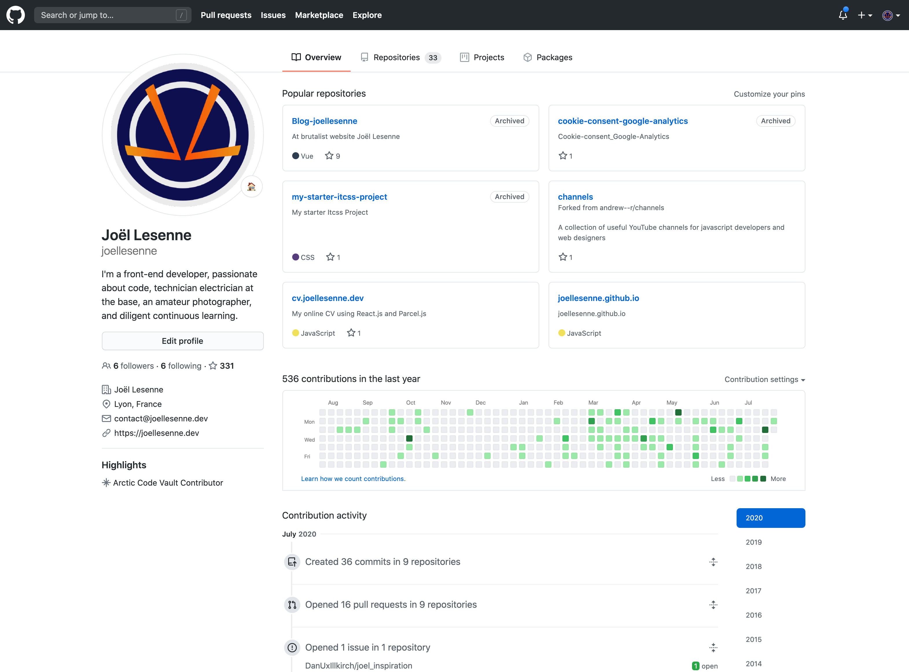
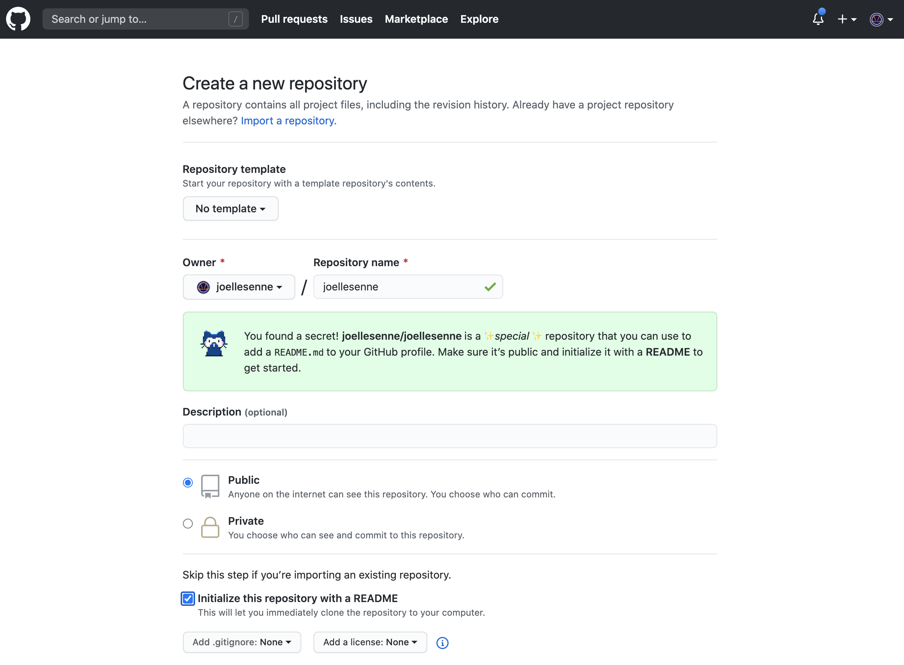
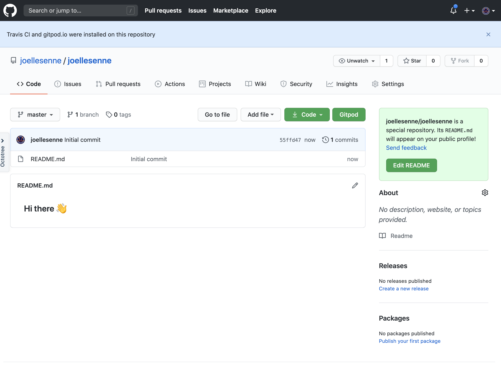
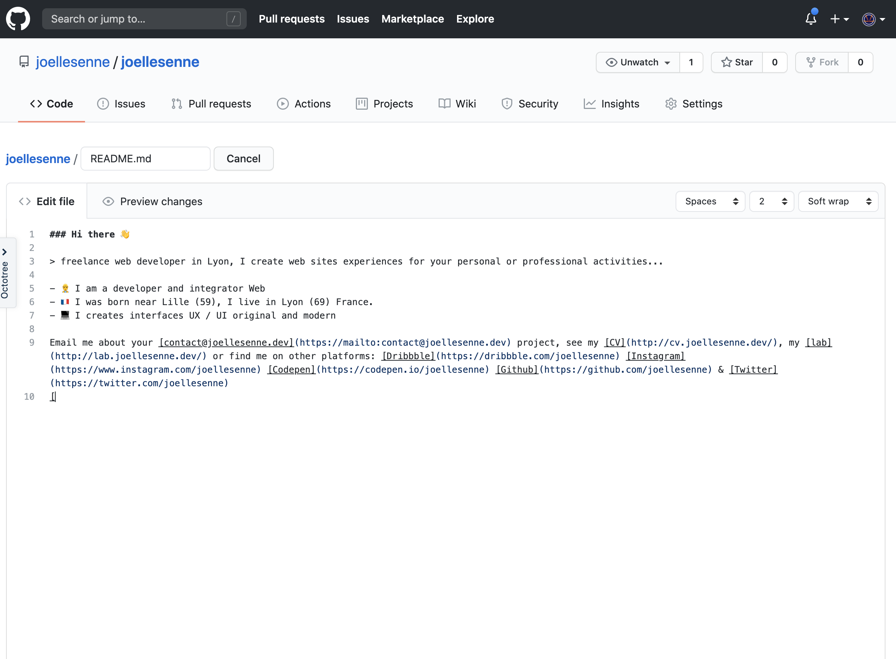
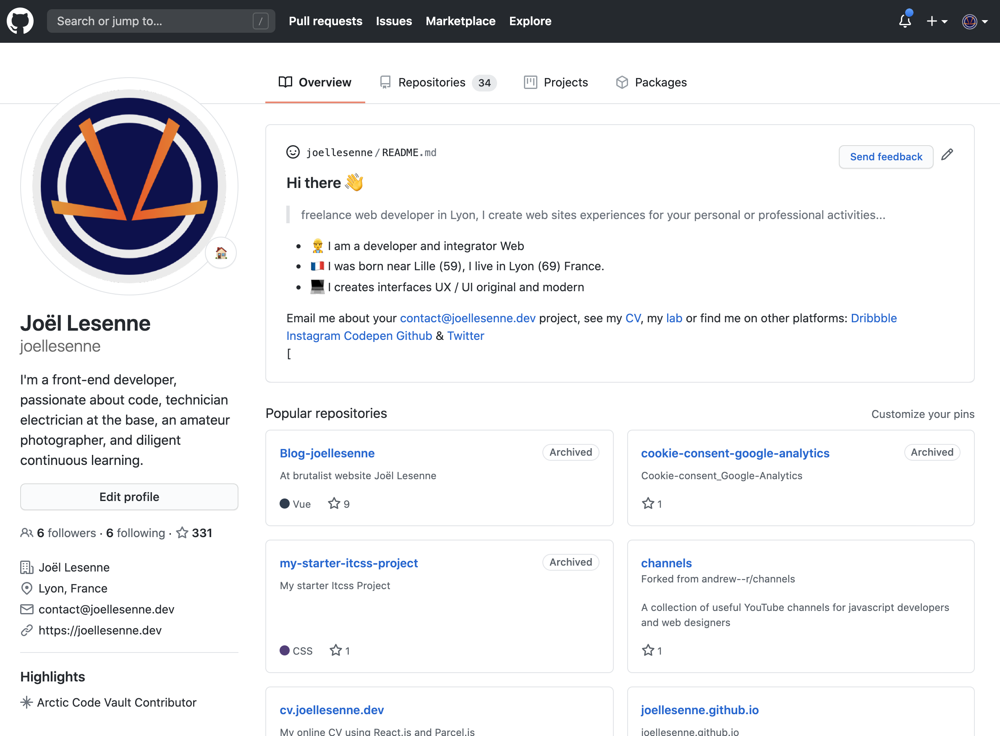

> J’ai vu récemment sur GitHub des présentations de profils développeurs et comment mettre en place cette chose bizarre ! 🙄🙄

Regardez mon profil de départ sur mon [dépôt Github](https://github.com/joellesenne)

Vous ne trouvez pas qu'il manque quelque chose ? 🤣🤣

Depuis peu, vous pouvez créer un [repo.new](https://repo.new/) qui parle de vous et rien d'autre, plutôt cool ! 👍👍

J'ai trouvé l'inspiration et comment faire avec [Monica Powell](https://www.aboutmonica.com/blog/how-to-create-a-github-profile-readme) et [CSS-TRICKS](https://css-tricks.com/the-github-profile-trick/) ! 🦄🦄

Vous allez sur votre compte Github et créer un nouveau dépôt avec votre pseudo (joellesenne pour moi) en mode public et initialiser le fichier `README.md`.

Une fois créé, vous serez amené à modifier le fichier 'README.md' et y ajouter votre texte (un exemple et fournis)

Heureusement, j'avais un extrait d'à-propos de moi cachés sur mon PC ! 😯😯

Il vous faudra faire un `Commit` pour valider le changement comme dans la vraie vie ! ❤️❤️

Et voilà, votre profil vient d'être créé ! 💪💪

C'est tout pour aujourd'hui. Je partagerai d'autres [astuces](https://joellesenne.dev/tag/astuces) promis ! 😉😉
