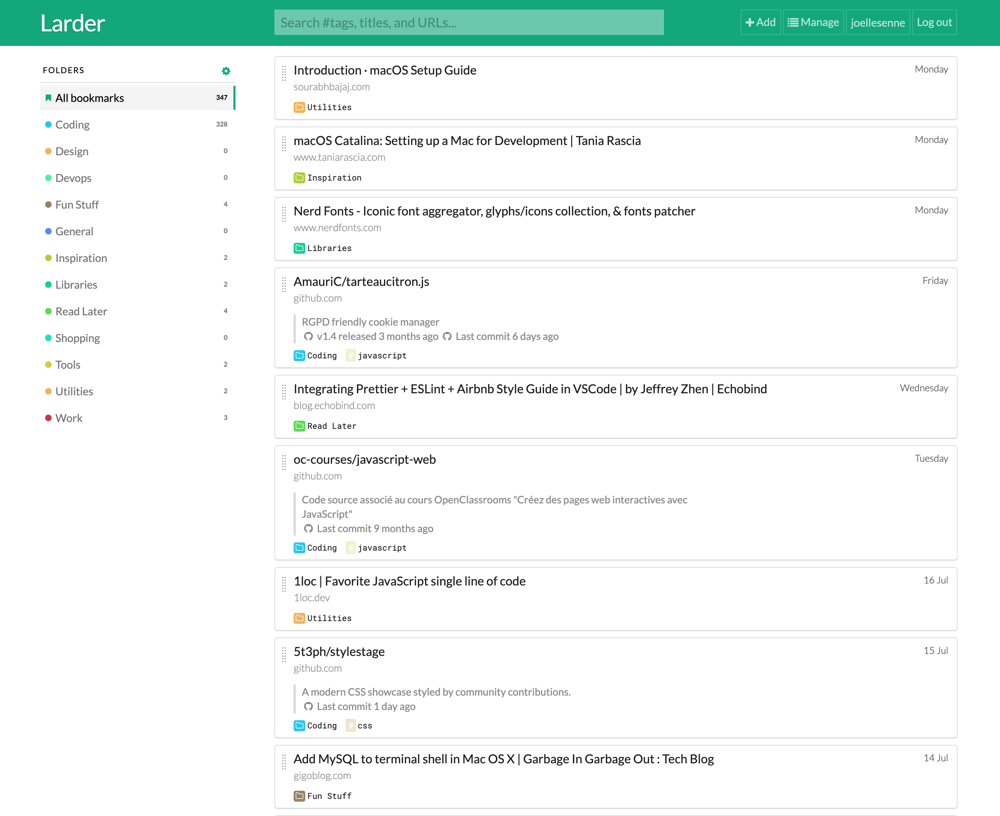

> depuis un mois, j'utilise [Larder.io](https://larder.io/) j'en ai même oublié mes favoris sur Chrome !

[Larder.io](https://larder.io/) est une un signet pour développeurs avec son extension pour vôtre navigateur préférée qui prend en charge vos liens favoris.

Le nommage des fichiers et plutôt bien penser pour un développeur lambda que je suis

Fait votre essai et dite moi vôtre ressenti

Plutôt cours ce post mais j'ai voulu partager mon coup de cœur, d'autres suivront
